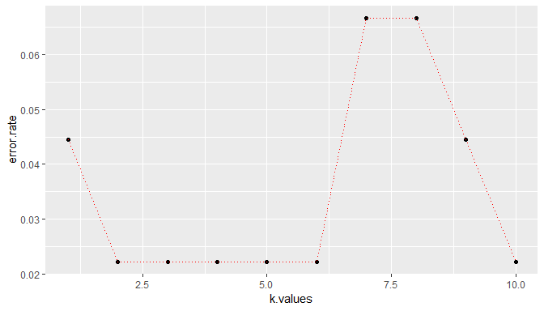

## Setup

### Load packages


```r
library(ggplot2)
library(dplyr)
library(statsr)
```

### Load data


```r
library(ISLR)
head(iris)
```

```
##   Sepal.Length Sepal.Width Petal.Length Petal.Width Species
## 1          5.1         3.5          1.4         0.2  setosa
## 2          4.9         3.0          1.4         0.2  setosa
## 3          4.7         3.2          1.3         0.2  setosa
## 4          4.6         3.1          1.5         0.2  setosa
## 5          5.0         3.6          1.4         0.2  setosa
## 6          5.4         3.9          1.7         0.4  setosa
```


* * *

## Part 1: Data

```r
str(iris)
```

```
## 'data.frame':	150 obs. of  5 variables:
##  $ Sepal.Length: num  5.1 4.9 4.7 4.6 5 5.4 4.6 5 4.4 4.9 ...
##  $ Sepal.Width : num  3.5 3 3.2 3.1 3.6 3.9 3.4 3.4 2.9 3.1 ...
##  $ Petal.Length: num  1.4 1.4 1.3 1.5 1.4 1.7 1.4 1.5 1.4 1.5 ...
##  $ Petal.Width : num  0.2 0.2 0.2 0.2 0.2 0.4 0.3 0.2 0.2 0.1 ...
##  $ Species     : Factor w/ 3 levels "setosa","versicolor",..: 1 1 1 1 1 1 1 1 1 1 ...
```


* * *

## Part 2: Feature  Scaling


```r
stand.features <- scale(iris[1:4])
var(stand.features[,1])
```

```
## [1] 1
```


```r
final.data <- cbind(stand.features,iris[5])

head(final.data)
```

```
##   Sepal.Length Sepal.Width Petal.Length Petal.Width Species
## 1   -0.8976739  1.01560199    -1.335752   -1.311052  setosa
## 2   -1.1392005 -0.13153881    -1.335752   -1.311052  setosa
## 3   -1.3807271  0.32731751    -1.392399   -1.311052  setosa
## 4   -1.5014904  0.09788935    -1.279104   -1.311052  setosa
## 5   -1.0184372  1.24503015    -1.335752   -1.311052  setosa
## 6   -0.5353840  1.93331463    -1.165809   -1.048667  setosa
```


* * *

## Part 3: Splitting into test and train model


```r
set.seed(101)

library(caTools)

sample <- sample.split(final.data$Species, SplitRatio = .70)
train <- subset(final.data, sample == TRUE)
test <- subset(final.data, sample == FALSE)
```


## Part 4: Modeling


```r
library(class)
predicted.species <- knn(train[1:4],test[1:4],train$Species,k=1)
```


```r
predicted.species
```

```
##  [1] setosa     setosa     setosa     setosa     setosa     setosa    
##  [7] setosa     setosa     setosa     setosa     setosa     setosa    
## [13] setosa     setosa     setosa     versicolor versicolor versicolor
## [19] versicolor versicolor virginica  versicolor versicolor versicolor
## [25] versicolor versicolor virginica  versicolor versicolor versicolor
## [31] virginica  virginica  virginica  virginica  virginica  virginica 
## [37] virginica  virginica  virginica  virginica  virginica  virginica 
## [43] virginica  virginica  virginica 
## Levels: setosa versicolor virginica
```

misclassfication:-

```r
mean(test$Species != predicted.species)
```

```
## [1] 0.04444444
```

Choosing a K value

```r
predicted.species <- NULL
error.rate <- NULL

for(i in 1:10){
    set.seed(101)
    predicted.species <- knn(train[1:4],test[1:4],train$Species,k=i)
    error.rate[i] <- mean(test$Species != predicted.species)
}
```


```r
k.values <- 1:10
error.df <- data.frame(error.rate,k.values)
```


```r
pl <- ggplot(error.df,aes(x=k.values,y=error.rate)) + geom_point()
pl + geom_line(lty="dotted",color='red')
```

<!-- -->
The error drops to its lowest for k values between 2-6. Then it begins to jump back up again, this is due to how small the data set it. At k=10 you begin to approach setting k=10% of the data, which is quite large.
